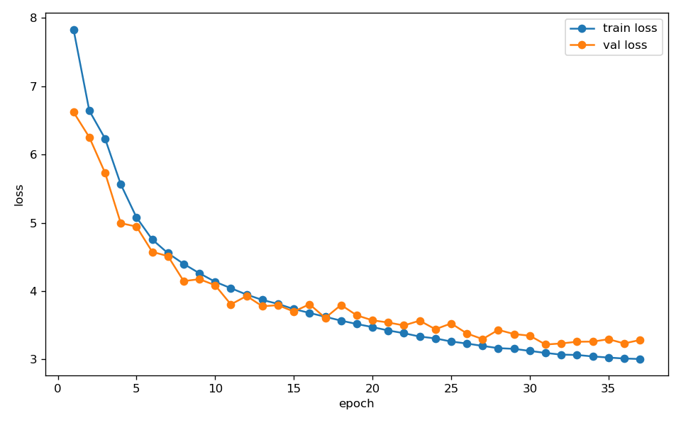
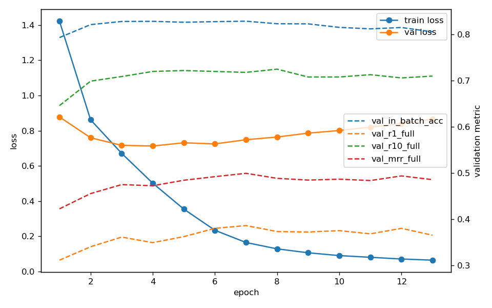
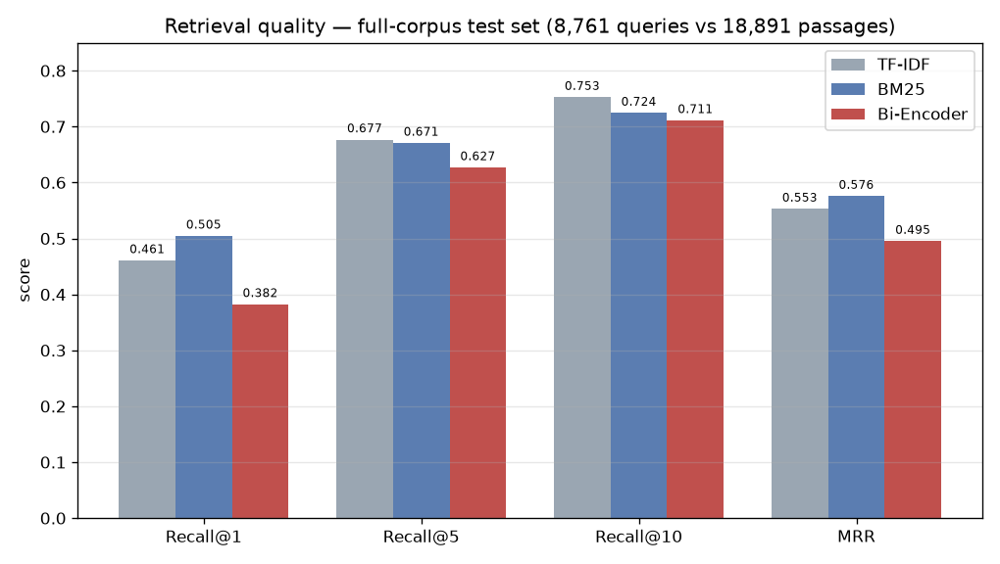

# ნეირონული საძიებო სისტემა — პროექტის ანგარიში

 - **მონაცემთა ბაზა:** SQuAD v1.1 (Stanford Question Answering Dataset) 
 - **მოდელი:** ბი-ენკოდერი, დატრენინგებული კონტრასტული InfoNCE loss-ით 
 - **დემო კორპუსი:** Jurafsky & Martin — *Speech and Language Processing*

---

## 1. შესავალი

ნეირონული საძიებო სისტემა იღებს მომხმარებლის query-ს და აბრუნებს კორპუსიდან ყველაზე რელევანტურ ტექსტურ მონაკვეთებს.
ქივორდებზე დაფუძნებული ძიებისგან განსხვავებით, ნეირონული ძიება
როგორც შეკითხვას, ისე დოკუმენტს გარდაქმნის ვექტორად (dense embedding) საერთო
ვექტორულ სივრცეში და რელევანტურობას ზომავს მნიშვნელობის (და არა სიტყვების ზუსტი
დამთხვევის) მიხედვით.

ზოგადი pipeline:

```
query → text encoder → query embedding → vector search → top-k chunks
```

ეს განსაკუთრებით მნიშვნელოვანია მაშინ, როცა მომხმარებლის კითხვის ფორმულირება განსხვავდება
დოკუმენტის ფორმულირებისგან — მაგალითად, შეკითხვამ *„how does beam search work?"* უნდა
დააბრუნოს ტექტსის ის მონაკვეთები, რომლებშიც ეს მეთოდი აღწერილია, თუნდაც ნაკლებად შეიცავდეს იგივე სიტყვებს.

პროექტის ფარგლებში აგებულია სრული retrieval pipeline: მონაცემთა მომზადება,
არა-ნეირონული baseline-ები, იმპლემენტირებული და დატრენინგებული ბი-ენკოდერი, და
რაოდენობრივი და თვისებრივი შეფასება. 

---

## 2. მონაცემები

პროექტში ორ ტექსტურ დოკუმენტს ვიყენებთ, განსხვავებული როლით:

| დოკუმენტი | როლი |
|---|---|
| **SQuAD v1.1** | query-passage წყვილებით მოდელს ვასწავლით სწორი მონაკვეთის პოვნას; test ნაკრებს კი ვიყენებთ რაოდენობრივი შეფასებისთვის |
| **Jurafsky & Martin წიგნი** | ამ წიგნში ვამოწმებთ, როგორ ეძებს სისტემა ახალ ტექსტში; მის unlabeled ტექსტს ასევე ვიყენებთ ტოკენიზატორისა და MLM warm-up-ის ტრენინგში |

ანუ მოდელი სწავლობს SQuAD-ზე, ხოლო რეალურად ეძებს და იტესტება *Speech and Language Processing*-ში , რომელზეც იქამდე ინფორმაცია არ ჰქონია.

### 2.1 მონაცემთა ბაზის არჩევანი — SQuAD v1.1

გამოვიყენეთ **SQuAD v1.1** (`rajpurkar/squad` HuggingFace-ზე) — reading comprehension მონაცემთა ბაზა,
რომელიც შედგება ადამიანების მიერ შექმნილი წყვილებისგან - (შეკითხვა, ვიკიპედიის პარაგრაფი).

| მახასიათებელი | მნიშვნელობა |
|---|---|
| წყარო | ვიკიპედიის სტატიები |
| შეკითხვის ტიპი | ადამიანის მიერ დაწერილი შეკითხვები |
| დოკუმენტის ტიპი | ვიკიპედიის პარაგრაფები (~100–250 სიტყვა) |
| წყვილების რაოდენობა | 87,599 |
| უნიკალური პარაგრაფი | 18,891 |

### 2.2 რატომ არის ეს მონაცემები შესაფერისი

- **ბუნებრივი შეკითხვები:** შეკითხვები ადამიანების მიერაა დაწერილი რეალურ ვიკიპედიის
  ტექსტზე დაყრდნობით და არა ხელოვნურად დაგენერირებული.
- **აზრობრივი კავშირი:** შეკითხვა ხშირად დოკუმენტის პარაგრაფებისგან განსხვავებული სიტყვებით აღწერს ინფორმაციას,
  რაც მოდელს აიძულებს ისწავლოს სემანტიკური მსგავსება და არა ზედაპირული დამთხვევა(მხოლოდ ცალკეული სიტყვების მიხედვით).
- **მისაღები ზომა:** პარაგრაფები თავისთავად 100–250 სიტყვისაა, ამიტომ ხელით დაჭრა
  (chunking) საჭირო არ არის.

### 2.3 query და document
თითოეული სატრენინგო მაგალითი წარმოადგენს (query, შესაბამისი დოკუმენტი) წყვილს, სადაც query არის კითხვა
და შესაბამისი დოკუმენტი — ვიკიპედიის ის პარაგრაფი, რომელიც პასუხს შეიცავს.
- **query:** მაგ. *„To whom did the Virgin Mary allegedly appear in 1858 in Lourdes France?"*
- **positive document:** "In 1858, the Virgin Mary allegedly appeared to Bernadette Soubirous in Lourdes..." 

### 2.4 in-batch negative sampling
გარდა ამისა, მოდელს უნდა ვასწავლოთ რა არის არასწორი. ამისთვის შეუსაბამო შედეგებს ცალკე არ ვაგროვებთ. 
ვიყენებთ **in-batch negatives**-ს: მოდელს ერთად ვაწვდით, მაგალითად, 256 კითხვას და 256 სწორ პასუხს (batch), 
პირველი კითხვისთვის დანარჩენი 255 პასუხი ავტომატურად ითვლება შეუსაბამოდ (negative). ეს ზოგავს დროსა და რესურსს.
რაც ბევრად ეფექტური და სწრაფია, ვიდრე ცალკეული sample-ებისთვის შეუსაბამო პასუხების შერჩევა(Explicit Negative Sampling).

### 2.5 train / validation / test დაყოფა

მთლიანი მონაცემები 80/10/10%-ზე გადავანაწილეთ. ამისათვის (კითხვა, პარაგრაფი) წყვილები ჯერ შემთხვევითად
ავურიეთ (shuffle) და შემდეგ დავჭერით (slice).

SQuAD-ის basic სპეციფიკიდან გამომდინარე, ერთი და იგივე შეკითხვა შეიძლება სხვადასხვა პარაგრაფს უკავშირდებოდეს.
ვინაიდან ჩვენ წყვილები შემთხვევით ავურიეთ, სატრენინგო და სატესტო სეტების წყვილებში 41 საერთო შეკითხვა აღმოჩნდა.
ეს არის ე.წ. მცირე მონაცემთა გაჟონვა, თუმცა ის სატესტო ნაკრების მხოლოდ 0.47%-ს შეადგენს. ეს წილი იმდენად უმნიშვნელოა, 
რომ მოდელის მიერ შედეგების ოვერფიტის რისკს გამორიცხავს და საბოლოო შეფასების ობიექტურობაზე გავლენას პრაქტიკულად არ ახდენს.

| ნაკრები | წყვილები | წილი |
|---|---|---|
| train | 70,079 | 80% |
| validation | 8,759 | 10% |
| test | 8,761 | 10% |

---

## 3. Baseline მოდელები

ნეირონულ მოდელამდე დავატრეინეთ ორი კლასიკური, არა-ნეირონული baseline, რომელთანაც შევადარეთ ჩვენი მოდელი. ორივე
ეფუძნება მხოლოდ სიტყვების ზუსტ დამთხვევას.

### 3.1 TF-IDF + კოსინუსური მსგავსება

ეს კლასიკური მიდგომა ტექსტს მათემატიკურ ენაზე თარგმნის. თუ სიტყვა ხშირად გვხვდება მოცემულ პარაგრაფში (მაღალი TF) და 
ამავდროულად იშვიათია სხვა ტექსტებში (მაღალი IDF), ის იღებს ძალიან მაღალ ქულას. თუ სიტყვა ყველგან გვხვდება (როგორც კავშირები და არტიკლები),
მისი IDF იქნება 0 და შესაბამისად, მთლიანი ქულაც 0-ის ტოლი გახდება. წინასწარ განსაზღვრული ლექსიკონის მიხედვით, დოკუმენტის 
თითოეული პარაგრაფი იღებს გრძელი ვექტორის სახეს. ამიტომ მიიღება sparse ვექტორები - ვინაიდან კონკრეტულ პარაგრაფში 
ლექსიკონში არსებული შესაძლო სიტყვიდან მხოლოდ რამდენიმე ათეული გვხვდება, ვექტორის უდიდესი ნაწილი ნულებითაა შევსებული. 

ძებნის პრინციპი: მომხმარებლის კითხვაც ზუსტად ასეთ ვექტორად გარდაიქმნება, რის შემდეგაც Cosine Similarity-ით 
ვზომავთ კუთხეს კითხვისა და დოკუმენტის ვექტორებს შორის. რაც უფრო მცირეა კუთხე, მით დიდია დამთხვევა.

ტექნიკური დეტალი: მოდელის დასახვეწად გამოვიყენეთ ბიგრამები — ანუ სიტყვები წყვილებად დავაჯგუფეთ, 
ლექსიკონის მაქსიმალური ზომა კი 50,000 უნიკალური ტერმინით შემოვფარგლეთ.


### 3.2 BM25 (Okapi BM25)

BM25 არის ალბათობაზე დაფუძნებული ძებნის ალგორითმი, TF-IDF-ის გაუმჯობესებული ვარიანტი. ის აგვარებს წინა მეთოდის ორ მთავარ მინუსს:

Term-frequency saturation: TF-IDF-ში თუ სიტყვა ტექსტში 20-ჯერ მეორდება, ის ავტომატურად 20-ჯერ უფრო მნიშვნელოვნად ითვლება.
BM25-ში კი გარკვეული რაოდენობის შემდეგ სიტყვის გამეორება ახალ შინაარსს აღარ ამატებს და მის წონას ხელოვნურად აღარ ზრდის (აშორებს saturation ეფექტს).

დოკუმენტის სიგრძის ნორმალიზაცია: გრძელ ტექსტებში ნებისმიერი სიტყვის შეხვედრის შანსი ბუნებრივად მაღალია. BM25 აბალანსებს
ამას და მოკლე, გრძელ პარაგრაფებს ლაკონურებთან შედარებით არ ანიჭებს უპირატესობას.

პროექტში ამ ალგორითმის რეალიზაციისთვის გამოვიყენეთ სტანდარტული პითონის ბიბლიოთეკა rank-bm25.

### 3.3 Baseline-ების შედეგები

შეფასებულია მთლიან ტესტ-სეტზე (8,761 შეკითხვა, 18,891 პარაგრაფი):

| მოდელი | Recall@1 | Recall@5 | Recall@10 | MRR |
|---|---|---|---|---|
| TF-IDF | 0.4608 | 0.6767 | **0.7525** | 0.5529 |
| BM25 | **0.5046** | 0.6707 | 0.7245 | **0.5757** |

ორივე მეთოდის პრობლემაა, რომ სრულად ეყრდნობა სიტყვების ზუსტ დამთხვევას - ვერ ცნობენ სინონიმებს და კითხვების კონტექსტს. 
თუ შეკითხვა პარაგრაფისგან განსხვავებულ სიტყვებს - სინონიმებს - იყენებს, ვერ აკავშირებს ერთმანეთთან. 

---

## 4. მოდელის არქიტექტურა

### Bi-Encoder

ვიყენებთ shared-weight bi-encoder-ს: ერთი და იგივე
ნეირონული ქსელი აენკოდირებს ცალკე როგორც შეკითხვას, ისე დოკუმენტს და გადააქვს საერთო
256-განზომილებიან სივრცეში. მთელი არქიტექტურა (multi-head attention, transformer block,
pooling) იმპლემენტირებულია უშუალოდ PyTorch-ის ბეის ლეიერებით (`src/model.py`).

```
input_ids
   │  token embedding (30k WordPiece) + learned positional embedding
   ▼
4 × Transformer block        pre-LayerNorm, multi-head self-attention,
   │                         GELU feed-forward (1536), residual კავშირები
   ▼
საბოლოო LayerNorm
   ▼
mean pooling non-padding ტოკენებზე
   ▼
Linear(384 → 256, bias-ის გარეშე)
   ▼
L2 ნორმალიზაცია              → ერთეულოვანი სიგრძის ემბედინგი
```

| ჰიპერპარამეტრი | მნიშვნელობა |
|---|---|
| ლექსიკონი (WordPiece tokenizer) | 30,000 |
| Transformer layers | 4 |
| მოდელის განზომილება (d_model) | 384 |
| attention heads | 6 |
| feed-forward განზომილება | 1536 |
| მაქსიმალური სიგრძე | 320 |
| embedding-ის განზომილება | 256 |
| პარამეტრების რაოდენობა | ≈ 18.8 მლნ |


- **WordPiece tokenizer:** ლექსიკონი ნასწავლია ჩვენივე კორპუსზე (SQuAD-ის პარაგრაფები და შეკითხვები).
- ჩვენმა მოდელმა იცის სპეციფიკური ტერმინების (მაგ. embeddings, skip-gram, lemmatization) დამუშავება და მათ უცნაურ    
  ტოკენებად აღარ შლის. ასევე იყენებს uncased ნორმალიზაცის, რომელიც უკეთ აზოგადებს სხვადასხვა case-ით შემოსულ შეკითხვებს.
- **Transformer ენკოდერი:** მოდელის ზომა (4 ფენა, d_model 384) შერჩეულია მონაცემების მასშტაბის
  მიხედვით — ~70 ათასი წყვილი ვერ გამოიწვევს ბევრად დიდ ქსელში overfitting-ს.
- **mean pooling**(და არა მხოლოდ `[CLS]` ტოკენი) უფრო სტაბილურ წინადადების წარმოდგენას იძლევა და
  ბუნებრივად გამორიცხავს padding ტოკენებს attention mask-ით.
- **projection layer (384→256)**: ტრანსფორმერიდან ინფორმაცია 384-განზომილებიანი გამოდის, ჩვენ კი მას Linear Layer-ით 256-მდე ვკუმშავთ. 
  ეს მუშაობს როგორც ფილტრი — მოდელი იძულებულია, მხოლოდ ყველაზე მნიშვნელოვანი ინფორმაცია დატოვოს. 256-განზომილებიანი 
  ვექტორების შენახვა და მათში ძებნა ბევრად უფრო სწრაფი და ეკონომიურია, რაც დიდ კორპუსებში მნიშვნელოვანია.
- **L2 ნორმალიზაცია**: ეს კომპონენტი ყველა ვექტორის სიგრძეს ათანაბრებს და 1-ის ტოლს ხდის. როდესაც ვექტორების სიგრძე 1-ია, კოსინუსური მსგავსების ფორმულა 
  უტოლდება სკალარულ ნამრავლს. ეს საშუალებას გვაძლევს, გამოვიყენოთ ვექტორული ბიბლიოთეკა (FAISS), რომელიც მილიარდობით 
  ვექტორში მომენტალურად ეძებს პასუხებს სკალარული ნამრავლის მეშვეობით.
- **საერთო წონები** ნეირონული ქსელი იყენებს საერთო წონებისგან შედგენილ ენკოდერებს. ანუ, კითხვასაც და პარაგრაფსაც ზუსტად ერთი და იგივე ქსელი ამუშავებს.
  ამით პარამეტრების რაოდენობა განახევრდა (37 მილიონის ნაცვლად 18.8 მილიონი), ასევე, ეს აიძულებს მოდელს, კითხვა და პასუხი ერთსა და იმავე 
  მათემატიკურ კოორდინატებში მოაქციოს.
---

## 5. ტრენინგი

მოდელის სწავლება ორი თანმიმდევრული ეტაპისგან შედგებოდა: წინასწარი მომზადება (Warm-up) და ძირითადი, კონტრასტული ტრენინგი.

### 5.1 ეტაპი 1 — self-supervised MLM pretraining

ვინაიდან ჩვენს მოდელს არ გააჩნია წინასწარი ენობრივი ცოდნა (სწავლობს ნულიდან), კონტრასტულ ეტაპზე პირდაპირ გადასვლა არაეფექტური იქნებოდა. ამიტომ, თავდაპირველად ჩავატარეთ Masked Language Modeling (MLM) ტრენინგი ჩვენსავე კორპუსზე (~88 ათასი ტექსტური ერთეული). ამ ეტაპზე ტოკენების 15% დინამიკურად იფარებოდა [MASK] ტოკენით, მოდელს კი მათი prediction ევალებოდა. ეს მოდელს დაეხმარა ენის სინტაქსის გაგებაში.

| პარამეტრი | მნიშვნელობა |
|---|---|
| batch size | 128 |
| learning rate | 5e-4 (warmup + cosine decay) |
| masking | 15% (დინამიური) |
| ეპოქები | 37 |

ვალიდაციის loss შემცირდა **6.62 → 3.22**-მდე, რაც ადასტურებს, რომ მოდელმა ისწავლა
ენის მნიშვნელოვანი სტრუქტურა.



### 5.2 ეტაპი 2 — კონტრასტული ტრენინგი (symmetric InfoNCE)

მეორე ეტაპზე, MLM-ით მომზადებული ენკოდერი დავატრენინგეთ კონტრასტული Symmetric InfoNCE Loss ფუნქციის გამოყენებით (კითხვა, პოზიტიური პასაჟი) წყვილებზე.
- ეფექტურობა: 256-იანი batch-ის გამო, თითოეული კითხვა იღებს 255 „უფასო“ in-batch ნეგატივს. ეს მიდგომა მათემატიკურად ბევრად უფრო სტაბილური და ეფექტურია, ვიდრე Triplet Loss (რომელიც მხოლოდ 1 ნეგატივს იყენებს). 
- Collision Masking: ვინაიდან SQuAD-ის სპეციფიკიდან გამომდინარე ბატჩში შეიძლება მოხვდეს სხვადასხვა კითხვა, რომელიც ერთსა და იმავე პასაჟს ეყრდნობა, კოდში (src/losses.py) ჩავამატეთ Mask. ეს გამორიცხავს შემთხვევებს, როდესაც სწორი პარაგრაფი სხვა იდენტური კითხვისთვის შეცდომით ნეგატივად ჩაითვლებოდა.
- სიმეტრიულობა: სიმეტრიული ფორმულირება მოდელს ორმხრივად ატრენინგებს: კითხვამ უნდა იპოვოს სწორი დოკუმენტი და დოკუმენტმა — სწორი კითხვა.
- ტემპერატურა ($\tau = 0.07$): ეს პარამეტრი აკონტროლებს მსგავსების განაწილებას, რაც მოდელს ეხმარება უფრო მკაფიოდ გამიჯნოს სწორი და არასწორი პასუხები.

| პარამეტრი | მნიშვნელობა |
|---|---|
| loss | symmetric InfoNCE, τ = 0.07 |
| batch size | 256 (→ 255 in-batch ნეგატივი) |
| optimizer | AdamW, weight decay 0.01 |
| learning rate | 3e-4 (warmup + cosine decay) |
| numerical precision | bf16 autocast |
| gradient clipping | 1.0 |
| გაჩერება | ადრეული გაჩერება სრულ-კორპუსზე val Recall@10-ის მიხედვით |

**model selection:** 
მნიშვნელოვანია აღინიშნოს, რომ ვალიდაციის პროცესში Recall@$k$ ითვლებოდა არა batch-ის შიგნით, არამედ მთელ კორპუსზე. ეს გამორიცხავს false positive-ს, 
რადგან in-batch მეტრიკები რეალურ, მთლიან სურათს არ ასახავს. 
საუკეთესო შედეგი დაფიქსირდა მე-8 ეპოქაზე (val Recall@10 = 0.725). ტრენინგი სულ 13 ეპოქა გაგრძელდა. ვინაიდან მომდევნო 5 ეპოქის განმავლობაში ხარისხი აღარ გაუმჯობესდა, გამოიყენა early stopping (Patience = 5). საბოლოო ვერსიად შევინახეთ სწორედ მე-8 ეპოქის საუკეთესო Checkpoint. 
Loss-ის კლება და ვალიდაციის მეტრიკების დასტაბილურება მიგვითითებს იმაზე, რომ მე-8 ეპოქის შემდეგ მოდელი უკვე მონაცემების ზეპირად დამახსოვრებას (Overfitting) იწყებდა, რაც ლოგიკურია ამ მასშტაბის მოდელისთვის.



---

## 6. შეფასება

### 6.1 მეტრიკები

მოდელის ხარისხის შესაფასებლად გამოვიყენეთ ორი მეტრიკა:

- Recall@$k$ — სატესტო შეკითხვების ის პროცენტული წილი, რომელთათვისაც სწორი პარაგრაფი მოხვდა სისტემის მიერ დაბრუნებულ Top-$k$ შედეგში.
ეს ზომავს, თუ რამდენად ზუსტად ეძებს მოდელი. 
- MRR (Mean Reciprocal Rank) — ითვალისწინებს სწორი პასუხის ზუსტ პოზიციას საძიებო სიებში (გამოითვლება როგორც $1/\text{Rank}$). რაც უფრო ზევითაა სწორი პასუხი, მით უფრო მაღალია MRR ქულა. ორივე მეტრიკა გამოთვლილია სრულ კორპუსზე (18,891 პასაჟი) ყველა 8,761 სატესტო შეკითხვისთვის.

### 6.2 შედეგები

| მოდელი | Recall@1 | Recall@5 | Recall@10 | MRR |
|---|---|---|---|---|
| TF-IDF | 0.4608 | 0.6767 | **0.7525** | 0.5529 |
| BM25 | **0.5046** | 0.6707 | 0.7245 | **0.5757** |
| ბი-ენკოდერი | 0.3824 | 0.6270 | 0.7112 | 0.4952 |



### 6.3 ანალიზი

ტესტირების შედეგებმა აჩვენა, რომ მოდელი საკმაოდ კონკურენტუნარიანია კლასიკურ 
ლექსიკურ მეთოდებთან. Recall@10-ის მიხედვით ის BM25 ალგორითმს მხოლოდ მცირედით (~1.3 პროცენტული პუნქტით) ჩამორჩება.

ჩვენი ნეირონული მოდელის მთავარი დადებითი მხარე სემანტიკური გაგებაა. ის პოულობს პასუხებს მაშინაც კი, როცა კითხვაში და პარაგრაფში
სრულიად სხვადასხვა სინონიმებია გამოყენებული.

გასათვალისწინებელია კონტექსტიც: სულ რაღაც 18.8 მილიონი პარამეტრის მქონე მოდელმა, რომელსაც არ ჰქონია წინასწარი ტრენინგი გიგანტურ ინტერნეტ-კორპუსებზე, შემთხვევების 71%-ში შეძლო სწორი პასაჟის პოვნა 19,000-მდე კანდიდატს შორის.

### 6.4 თვისებრივი ანალიზი — ძიება Jurafsky & Martin-ის წიგნში

მოდელის გენერალიზაციის უნარის შესამოწმებლად, მოდელი გავუშვით სრულიად უცხო, ტრენინგის დროს უნახავ ტექსტზე —  J&M-ის წიგნზე.
მოდელის შედეგები:

- **„How does beam search decoding work?"** → "Beam search is common in language model generation tasks. For tasks like MT, which we’ll return to in Chapter 13,  
  we generally use beam widths k between 5 and 10. What do we do with the resulting k hypotheses? In some cases, all we need from our language model generation    
  algorithm."

- **„What is the difference between stemming and lemmatization?"** -> "Morphologically, languages are often characterized along two dimensions of variation. The  
  first is the number of morphemes per word, ranging from isolating languages like Vietnamese and Cantonese, in which each word generally has one morpheme, to 
  polysynthetic languages like Siber..."
  
- **„What is Bidirectional RNN??"** → აბრუნებს სწორ პასუხს:
  "[jm_0299] (sim 0.880) A bidirectional RNN (Schuster and Paliwal, 1997) combines two independent RNNs, one where the input is processed from the start to the end, and the other from the end to the start. We then concatenate the two representations computed by the networks into a single vector that capt..."


ეს ექსპერიმენტი ამტკიებს, რომ bi-encoder-ს შეუძლია სემანტიკური ძებნა. მიუხედავად იმისა, რომ ზუსტ და გამართულ პასუხებს არ 
აბრუნებს დასმულ კითხვებზე, მისი დაბრუნებული პასუხები კითხვასთან სემანტიკურად/შინაარსობრივად დაკავშირებულია და ლოგიკურადაა გადაბმული. 
ასევე აღსანიშნავია, რომ ის არ ეძებს პარაგრაფებს, რომელშიც აუცილებლად ხვდება კითხვაში ნახსენები სიტყვები, არამედ ისეთებს, რომლებიც შინაარსობრივად ახლოსაა.

---

## 7. დასკვნა

### წარმატებული კომპონენტები:
- ორეტაპიანი სწავლება (MLM Warm-up + InfoNCE): ამ მიდგომამ მისცა საშუალება წინასწარი ცოდნის გარეშე არსებულ მოდელს,  მიეღწია Baseline-ების (BM25, TF-IDF) 
კონკურენტუნარიან შედეგებამდე.
- In-batch Negatives-ის ეფექტურობა: ტრენინგის პროცესში ამ მეთოდმა დაამტკიცა თავისი მათემატიკური სტაბილურობა და გამოთვლითი რესურსების მაქსიმალური ოპტიმიზაცია.
- mean Pooling-ისა და პროექციის ფენის ($384 \rightarrow 256$) კომბინაციამ შექმნა სწრაფი, მცირე ზომის მოდელი.


### მიმდინარე შეზღუდვები და კომპრომისები:
- ლექსიკური დამოკიდებულება Recall@1-ზე: ტესტირებამ აჩვენა, რომ BM25 კვლავ ეფექტურია იმ შემთხვევებში, როდესაც შეკითხვა ზუსტად იმეორებს პასაჟის ტერმინოლოგიას. მაქსიმალური სიზუსტის მისაღწევად, ოპტიმალური იქნებოდა ჰიბრიდული საძიებო სისტემის (BM25 + ბი-ენკოდერი) გამოყენება.
- „მარტივი“ ნეგატივები ტრენინგისას: In-batch მეთოდით მოდელი მხოლოდ მარტივ ნეგატივებს ხედავდა. მას არ ჰქონია შეხება რეალურად რთულ (სემანტიკურად მსგავს, მაგრამ შინაარსობრივად არასწორ) პარაგრაფებთან, რაც ზღუდავს მის საბოლოო პოტენციალს.
- ჰიპერპარამეტრების ოპტიმიზაცია: ძირითადი პარამეტრები (ტემპერატურა $\tau$, Learning Rate, Batch Size) აღებულია არსებული სამეცნიერო ლიტერატურიდან და პროექტის ფარგლებში Hyperparameter Tuning არ მომხდარა დროისა და რესურსების სიმცირის გამო.
 
---

## პროექტის მოკლე შეჯამება

| კომპონენტი | არჩევანი |
|---|---|
| სატრენინგო მონაცემები | SQuAD v1.1 (87,599 წყვილი) |
| კორპუსი | 18,891 უნიკალური ვიკიპედიის დოკუმენტი |
| ტოკენაიზერი | საკუთარი WordPiece, 30k ლექსიკონი |
| ენკოდერი | transformer ბი-ენკოდერი, 4 ლეიერი, ≈18.8 მლნ პარამეტრი |
| pooling | mean pooling non-padding ტოკენებზე |
| proj | Linear(384→256) + L2 ნორმა |
| loss | symmetric InfoNCE, τ=0.07 |
| ოპტიმიზატორი | AdamW, lr 3e-4, wd 0.01 |
| ტრენინგი | MLM pretraining (37 ეპოქა) + კონტრასტული (8 ეპოქა) |
| ინდექსი | cosine similarity / FAISS IndexFlatIP |
| დემოს კორპუსი | Jurafsky & Martin — Speech and Language Processing |
